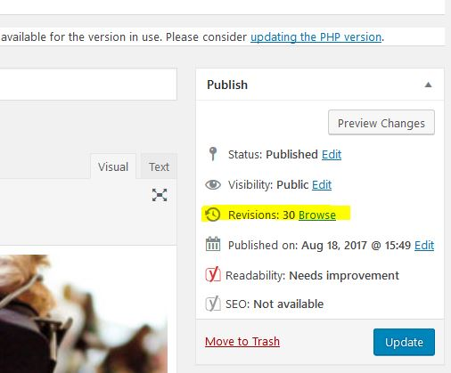
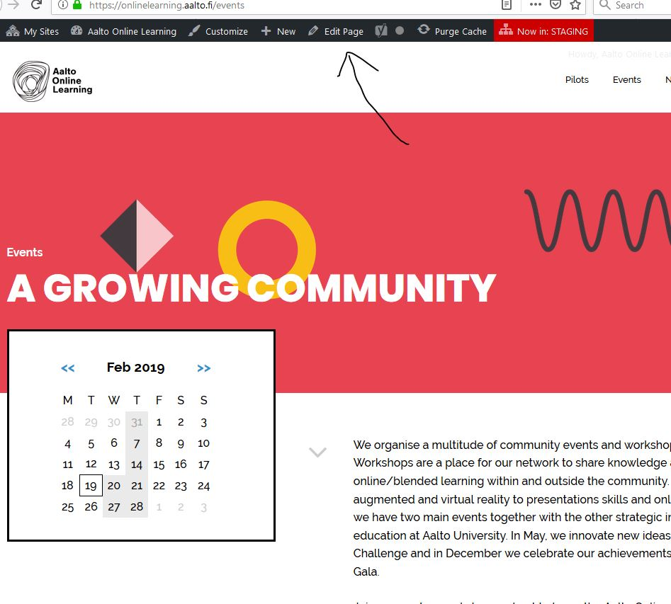

# Aole2019 Theme edition

The other links under this section will display snapshots of the theme site. Hover the mouse over whichever element you need to edit, and it will display how to edit that item, plus some notes.

The terms used in the mentioned interactive images can be disambiguated using this file.
Keep in mind that you can open links in a new tab should you need to see two help pages side-by-side

## To keep in mind:

In order to allow greater editing flexibility, some contents are written in HTML. This has the advantage of letting the contents to be changed without needing a developer.

The disadvantage, however, is the risk of breaking said HTML code, causing the page to appear different than intended. This happens when a content that has advanced HMTL contents is edited using the visual editor. Please be in contact with the person in charge before editing some of the main pages, such as the homepage.

If the HTML content of a page becomes broken, it is possible to recover it thanks to Wordpress' version history. When you need to recover something from previous versions of the content, find the "revisions" link at the right of the post editor, as shown in the next picture.

At the time of writing this documentation, the contents that should not be edited using the visual editor are:
* page: home
  * post-content standard field

## Key terms:
### wp-admin

Is the admin panel of wordpress, which is accessed by adding /wp-admin to the home address (e.g. http://onlinelearning.aalto.fi/wp-admin) and logging in with the correct credentials.
The Wp-admin has multiple options. The most common edition pages that are used in the WP-admin are:

#### post editor

Despite being called *post editor* it is also used to edit pages, and in the case of this theme, there are some page sections that are editable using the post editor (e.g. the footer).

Depending on what you want to edit, the post editor is opened differently. In order to edit, for example, a page; you would need to open the "pages" menu, and then select which page you want to edit. There is an easier way, however, to access the post editor of a page or post: simply visit it, and click on the "edit" button which appears on top (only when you are logged in).

The post editor might have different types of fields. This is not important to know as a content editor, but as a developer. Some fields were added by using the "custom field" plugin. Some other fields are standard in Wordpress.

The standard post fields are:
* post-content (it doesn't have a visible title): the main content of the post.
* featured image: the main image of the post, often used post list
* title (it doesn't have a visible title): the visible title of the post.
* permalink: the URL whereby the post is visited.
* slug (invisble): the url-friendly name of the post, which most often is equal to the last bit of the post permalink (e.g. http://onlinelearning.aalto.fi/about => about)

### Customizer

Customizer is the menu that can be opened by clicking "customizer" in the admin bar.

### Hard-coded items

Most of the characteristics of the template are not intended to change, such as the styling, how the posts are listed, etc. In these cases, the content comes included in the source file and cannot be changed using the wp-admin interface. To change a hard-coded content, you need to change the source of the theme. More help about this is available at the "for developers" section of this help file.
